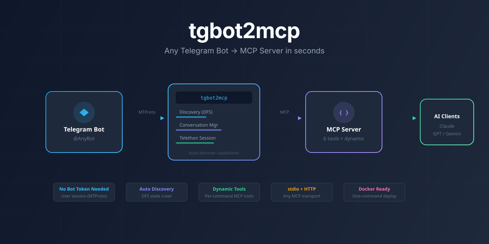

<p align="center">
  
</p>

<p align="center">
  <strong>English</strong> |
  <a href="#ru">Русский</a> |
  <a href="#zh">中文</a>
</p>

---

# tgbot2mcp — Telegram Bot to MCP Server Adapter

**Turn any Telegram bot into a ready-to-use [Model Context Protocol (MCP)](https://modelcontextprotocol.io/) server.** No bot token required. Works with any existing Telegram bot through your user account.

> **What is tgbot2mcp?** It is an open-source Python adapter that connects to Telegram as a user (via MTProto/Telethon), auto-discovers a target bot's capabilities using depth-first search, and exposes them as MCP tools — so AI agents like Claude, ChatGPT, and Gemini can interact with any Telegram bot programmatically.

---

## What Problem Does This Solve?

Telegram bots are everywhere — customer support, order tracking, payments, internal tools — but AI agents cannot interact with them directly. **tgbot2mcp** bridges this gap:

- **Before:** AI agents have no way to use Telegram bots
- **After:** Any Telegram bot becomes a set of MCP tools that AI agents can call

No API keys from the bot owner. No cooperation from the bot developer. Just point it at `@AnyBot` and go.

---

## How It Works

```
┌─────────────┐     MTProto      ┌─────────────┐      MCP       ┌─────────────┐
│  Telegram    │ ───────────────▶ │  tgbot2mcp  │ ─────────────▶ │  AI Agent   │
│  Bot (@bot)  │ ◀─────────────── │             │ ◀───────────── │ (Claude etc)│
└─────────────┘   Bot responses   │  • Discover │   Tool calls   └─────────────┘
                                   │  • Interact │
                                   │  • Expose   │
                                   └─────────────┘
```

1. **Authenticate** — Log in with your Telegram account (phone number, like a normal client)
2. **Discover** — tgbot2mcp crawls the bot: `/start`, `/help`, buttons, inline keyboards, full state graph via DFS
3. **Expose** — Every discovered action becomes an MCP tool the AI can call
4. **Interact** — AI agents send messages, click buttons, navigate bot states — all through MCP

---

## Quick Start

### Prerequisites

- Python 3.11+
- Telegram API credentials from [my.telegram.org/apps](https://my.telegram.org/apps)

### Install

```bash
pip install -e .
```

### Login

```bash
tgbot2mcp login
```

Authenticates interactively (phone → code → 2FA if enabled). Session saved to `~/.tgbot2mcp/sessions/`.

### Inspect a Bot

```bash
tgbot2mcp inspect @SomeBot
```

Runs discovery and prints all commands, buttons, and states found.

### Start MCP Server

```bash
# stdio transport (Claude Desktop, etc.)
tgbot2mcp serve @SomeBot

# HTTP transport
tgbot2mcp serve @SomeBot --transport http --port 8080

# Skip discovery (universal tools only)
tgbot2mcp serve @SomeBot --no-discover
```

### Generate Standalone Server

```bash
tgbot2mcp generate @SomeBot --output ./generated
```

Creates a self-contained Python MCP server with discovered commands hardcoded as dedicated tools.

---

## MCP Tools

### Universal Tools

Available for any bot, no discovery needed:

| Tool | What it does |
|------|-------------|
| `telegram_bot_send` | Send text (or `/command`) and get the response |
| `telegram_bot_click_button` | Click an inline or reply-keyboard button |
| `telegram_bot_get_messages` | Read recent messages from the conversation |
| `telegram_bot_wait_for_response` | Wait for a delayed bot response |
| `telegram_bot_reset_session` | Reset conversation state (use when stuck) |
| `telegram_bot_get_discovered_actions` | List all auto-discovered commands and buttons |

### Dynamic Tools (auto-generated from discovery)

After discovery, tgbot2mcp creates dedicated tools:

- **`telegram_bot_cmd_{name}`** — one tool per slash command (`/start`, `/help`, `/settings`, etc.)
- **`telegram_bot_btn_{label}`** — one tool per button found in bot responses

---

## Architecture

Built by composing proven open-source foundations:

| Component | Source | Role |
|-----------|--------|------|
| **Discovery engine** | [BotFuzzer](https://github.com/seniorsolt/BotFuzzer) | DFS bot crawling, state graph construction |
| **Interaction layer** | [TgTestKit](https://github.com/elebur/tgtestkit) | Telethon messages, buttons, edited messages, timeouts |
| **MCP server** | [MCP Python SDK](https://github.com/modelcontextprotocol/python-sdk) | Standard MCP protocol implementation |
| **Transport** | Telethon (MTProto) | User-session Telegram access |

---

## Configuration

Config file: `~/.tgbot2mcp/config.yaml`

```yaml
api_id: 12345
api_hash: "your_api_hash"
session_dir: ~/.tgbot2mcp/sessions
default_timeout: 20.0
wait_consecutive: 2.0
global_action_delay: 0.8
log_level: INFO
discovery_max_depth: 5
discovery_max_repeats: 1
```

Environment variables (override config file):
- `TG_API_ID` / `TELEGRAM_API_ID`
- `TG_API_HASH` / `TELEGRAM_API_HASH`

---

## Claude Desktop Integration

Add to your `claude_desktop_config.json`:

```json
{
  "mcpServers": {
    "telegram-bot": {
      "command": "tgbot2mcp",
      "args": ["serve", "@YourBotName"],
      "env": {
        "TG_API_ID": "YOUR_API_ID",
        "TG_API_HASH": "YOUR_API_HASH"
      }
    }
  }
}
```

See [`examples/claude_desktop_config.json`](examples/claude_desktop_config.json) for a complete example.

---

## Docker

```bash
# Interactive login
docker compose run tgbot2mcp login

# Start MCP server
docker compose run tgbot2mcp serve @SomeBot
```

---

## FAQ

<details>
<summary><b>Do I need the bot's API token?</b></summary>
No. tgbot2mcp uses your Telegram user session (MTProto), not the Bot API. It works with any bot, even ones you don't own.
</details>

<details>
<summary><b>Is this safe?</b></summary>
Session files give full access to your Telegram account. Never share them. They are stored with <code>0600</code> permissions in <code>~/.tgbot2mcp/sessions/</code>.
</details>

<details>
<summary><b>Which AI clients are supported?</b></summary>
Any MCP-compatible client: Claude Desktop, Cursor, Continue, Cline, and others. The server supports both stdio and HTTP transports.
</details>

<details>
<summary><b>How does discovery work?</b></summary>
tgbot2mcp sends <code>/start</code> and <code>/help</code>, collects BotFather-registered commands, parses button keyboards, and performs DFS traversal to map the bot's state graph.
</details>

<details>
<summary><b>Can I use it with any Telegram bot?</b></summary>
Yes. Any public Telegram bot that accepts messages from users will work. No special configuration needed on the bot's side.
</details>

---

## Development

```bash
pip install -e ".[dev]"
pytest
tgbot2mcp --log-level DEBUG serve @SomeBot
```

---

## License

MIT

---

<a id="ru"></a>
## 🇷🇺 Русский

**tgbot2mcp** — адаптер, который превращает любого Telegram-бота в готовый [MCP-сервер](https://modelcontextprotocol.io/) (Model Context Protocol). Токен бота не нужен — работает через ваш пользовательский аккаунт Telegram.

**Как это работает:**

1. Вы авторизуетесь в Telegram (как в обычном клиенте — по номеру телефона)
2. Указываете бота, например `@SomeBot`
3. tgbot2mcp автоматически обнаруживает возможности бота: команды, кнопки, состояния (через DFS-обход)
4. Всё это становится MCP-инструментами, которые AI-агенты (Claude, ChatGPT, Gemini) могут вызывать

**Быстрый старт:**

```bash
pip install -e .
tgbot2mcp login
tgbot2mcp serve @SomeBot
```

**Нужен только Python 3.11+ и API-ключи Telegram** с [my.telegram.org/apps](https://my.telegram.org/apps).

---

<a id="zh"></a>
## 🇨🇳 中文

**tgbot2mcp** — 适配器，可将任何 Telegram 机器人转换为即用的 [MCP 服务器](https://modelcontextprotocol.io/)（Model Context Protocol）。无需机器人 Token — 通过您的 Telegram 用户账户运行。

**工作原理：**

1. 使用 Telegram 登录（像普通客户端一样通过手机号验证）
2. 指定目标机器人，例如 `@SomeBot`
3. tgbot2mcp 自动发现机器人功能：命令、按钮、状态（通过 DFS 遍历）
4. 所有功能变成 MCP 工具，AI 代理（Claude、ChatGPT、Gemini）可直接调用

**快速开始：**

```bash
pip install -e .
tgbot2mcp login
tgbot2mcp serve @SomeBot
```

**只需 Python 3.11+ 和 Telegram API 密钥**，从 [my.telegram.org/apps](https://my.telegram.org/apps) 获取。

---

<p align="center">
  <sub>Built with Telethon · MCP Python SDK · Inspired by BotFuzzer & TgTestKit</sub>
</p>
